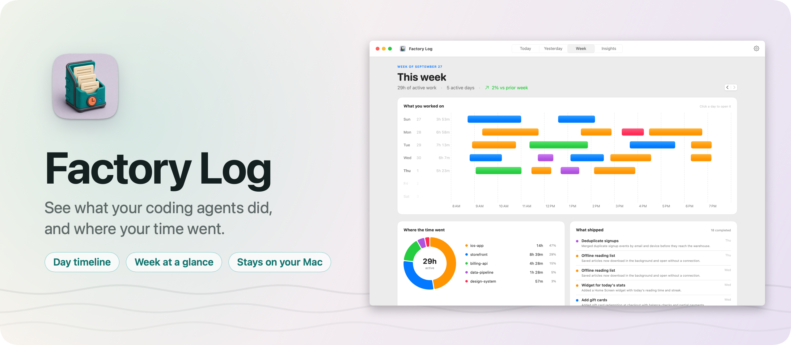
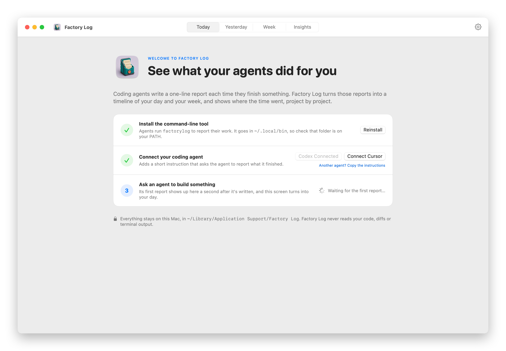
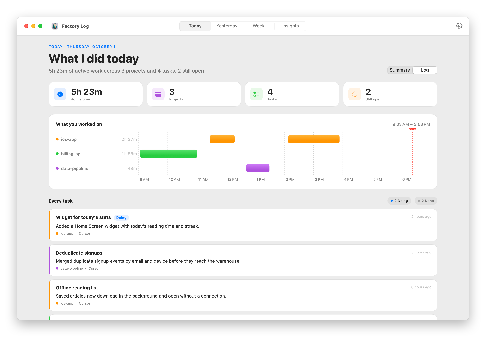
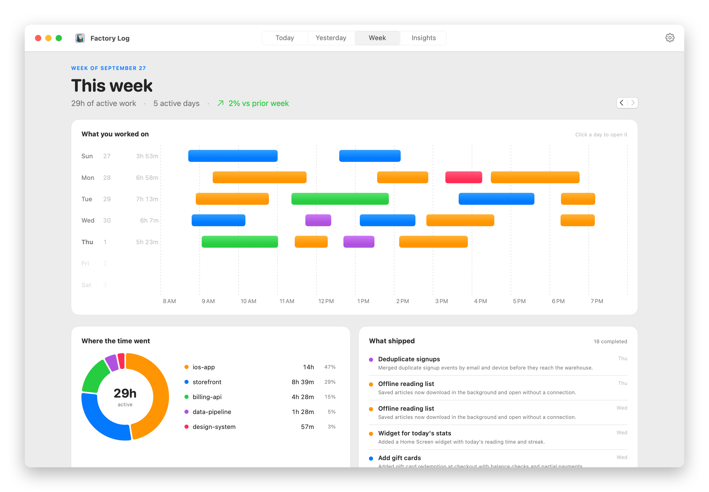
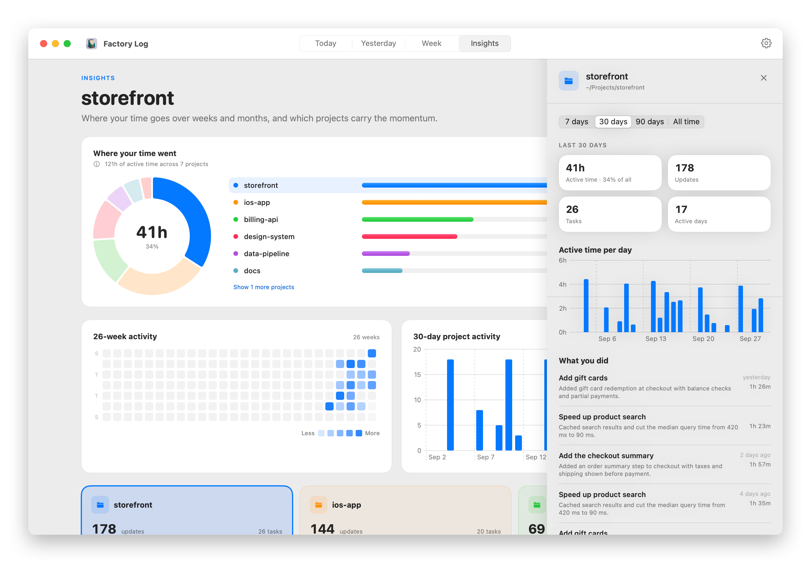

Factory Log shows what your coding agents did for you: a timeline of each day and each week, and where your time went, project by project. Codex, Cursor or any other agent writes a one-line report when it finishes something, and the report shows up in the app a second later.

When agents work across five projects in a day, it's hard to say in the evening what actually happened. Factory Log keeps that record for you, written by the agents themselves, in a plain file on your Mac. It never reads your code, your diffs or your terminal.

## Download

Get `Factory-Log-1.0.0.zip` from the [latest release](https://github.com/flaviocopes/factorylog/releases/latest), unzip it, and drag Factory Log to your Applications folder. It runs on macOS 15 Sequoia or later, on Apple silicon and Intel Macs.

### Opening it the first time

Factory Log isn't signed with an Apple Developer ID or notarized by Apple. So the first time you open it, macOS says it "could not verify Factory Log is free of malware". Click **Done**, then allow it in one of two ways.

In System Settings, open **Privacy & Security** and scroll down to the message about Factory Log. Click **Open Anyway**, confirm, and open the app again. The button shows up for about an hour after you try to open the app.

In Terminal, remove the quarantine flag macOS adds to downloaded files, then open the app:

```sh
xattr -dr com.apple.quarantine "/Applications/Factory Log.app"
```

The same command fixes a message saying Factory Log is damaged. You don't need to turn off Gatekeeper for either option.

On a work laptop you might not be able to install apps in `/Applications`. You can keep Factory Log in the `Applications` folder inside your home folder, and run the command on `~/Applications/Factory Log.app`. If your company blocks apps that aren't notarized, ask your IT team.

### Updates

Once a day, Factory Log asks GitHub whether there's a newer version. When there is, it shows what's new, and **Install and Relaunch** puts it in place of the old one. **Factory Log → Check for Updates…** checks right away.

To turn off the daily check, run this in Terminal:

```sh
defaults write dev.factorylog.app AppUpdaterAutomaticChecks -bool false
```

## Set it up

The first time you open Factory Log, it walks you through three steps:

1. **Install the command-line tool.** Agents report through `factorylog`, which the app copies to `~/.local/bin`. Make sure that folder is on the `PATH` your agent uses.
2. **Connect your agent.** One click adds a short instruction to `~/.codex/AGENTS.md` for Codex, or a rule to `~/.cursor/rules` for Cursor. Using something else? Copy the instructions and paste them into your agent's instructions file.
3. **Ask an agent to build something.** Its first report lands a second later, and the welcome screen turns into your day.



## Features

- **What I did today, and yesterday.** Each day opens with your active time, the projects you touched and the tasks agents finished. A timeline shows one lane per project across the hours, with a bar for every work session. Hover a bar to see its tasks.
- **Every task, once.** The log lists each task with its latest report, newest first. Tasks still open say **Doing**, and you can close one with a final outcome.
- **A one-line recap per project.** Finished days get a sentence for each project, written by a local [Ollama](https://ollama.com) model if you have one. Without it you see the task titles instead.
- **Your week at a glance.** One row per day, one bar per session, colored by project. Next to it, a donut of where the week went and the list of what shipped. Step back through earlier weeks with the arrows.
- **The long view.** Insights shows your time by project over the last 7, 30 or 90 days or all time, a 26-week heatmap and the busiest projects. Click a project to open a panel with its time, its daily rhythm and every task you did there.
- **Live.** The app watches the log, so new reports appear on their own. There's no refresh button.
- **Hide what doesn't matter.** Right-click a project to hide it, and bring it back from Settings. Work done inside an agent's own folder, like `~/.cursor` or `~/.codex`, never shows up.
- **Keyboard.** ⌘1 to ⌘4 switch between Today, Yesterday, Week and Insights. The arrow keys switch between a day's summary and its log, or between weeks. Esc steps back out.

<picture>
  <source media="(prefers-color-scheme: dark)" srcset="docs/screenshot-today-dark.png" />
  
</picture>

<picture>
  <source media="(prefers-color-scheme: dark)" srcset="docs/screenshot-week-dark.png" />
  
</picture>

<picture>
  <source media="(prefers-color-scheme: dark)" srcset="docs/screenshot-insights-dark.png" />
  
</picture>

## The command line

Agents call three commands. You can call them too:

```sh
factorylog start --title "Add account settings" --summary "Started the settings screen." --source codex
factorylog report --task-id task_123 --summary "Added validation and tests."
factorylog archive --task-id task_123 --summary "Finished and verified account settings."
```

`start` returns the task ID in its JSON output, and the other two use it. Every command prints JSON, takes `--store` to write to another log and `--timestamp` to record a past time, and `factorylog --help` lists the rest. A task left open for 24 hours is marked Done automatically.

## Privacy

Everything Factory Log records stays on your Mac, in `~/Library/Application Support/Factory Log/`. There are no accounts, no analytics and no server.

The app goes online in two cases. Once a day it asks GitHub whether there's a newer version, and it downloads one only when you click **Install and Relaunch**. If you run Ollama, it sends a finished day's report text to it to write the recaps, which stays on your Mac unless you point `FACTORYLOG_OLLAMA_HOST` at another machine.

The reports are whatever your agents write. The instructions Factory Log installs tell them never to include code, diffs, command output or secrets. [PRIVACY.md](PRIVACY.md) has the details.

## How it works

Factory Log is one Swift package with three parts. `FactoryLogCore` holds the data model, the event store and every query. The `factorylog` command and the SwiftUI app are both thin clients of it, so they can't disagree about what's in the log.

### The log is a text file

Every report is one line of JSON in `events.jsonl`, with the task, the project folder, the agent, a timestamp and the sentence the agent wrote. Lines are only ever added. Correcting something means adding a new report, and closing a task means adding an archive line. You can read the whole history with `cat`, and [docs/event-contract.md](docs/event-contract.md) describes the format.

### Several agents can write at once

Before writing, the CLI takes an exclusive `flock` on a lock file next to the log. Under that lock it rereads the log and checks the report makes sense: the task exists, isn't closed, and keeps its project and title. Then it appends one line and calls `fsync`. Readers take a shared lock. A line cut short by a crash is skipped, and a malformed or future-version line is reported by line number while the rest of the history stays readable.

### The app watches the file

A file-system dispatch source tells the app when the log grows, and it reloads in the background. On each reload it also archives any task that has been open for 24 hours, under the same lock.

### Time is estimated, not tracked

Agents report outcomes, not hours, so Factory Log infers the time from when reports arrive. Within a project, reports at most 45 minutes apart form one work session, and each session gets 5 extra minutes for the work before its first report. Those sessions are the bars in every timeline, and their lengths add up to the active time. Each project is measured on its own, so two agents working in parallel count toward both projects.

### Recaps are cached

For a finished day, Factory Log sends each project's reports to a local Ollama model (`gemma3:4b` by default) and asks for one plain sentence. The sentence is saved in `narratives.json` with a signature of the reports it came from. A new report changes the signature, so a stale recap gets rewritten. The numbers and task titles always come from the log, never from the model.

### Updates verify what they install

The updater downloads the release zip next to the app and compares its SHA-256 with the digest GitHub computed at upload. It checks that the bundle ID, the version and the code signature match before it swaps the app in place and relaunches it.

[ARCHITECTURE.md](ARCHITECTURE.md) goes deeper into the targets, the data flow and how storage recovers from problems.

## Build it from source

You need macOS 15 or later and Xcode 26, for Swift 6.2.

```sh
swift test
zsh Scripts/build-app.zsh debug
open ".build/Factory Log.app"
```

To build the release zip, run:

```sh
zsh Scripts/build-release.zsh
```

It builds a universal app, checks its signature, and zips it into `dist/`. The app is ad-hoc signed, and a copy you build yourself opens without a warning.

## Development

```sh
zsh Scripts/verify-release.zsh         # tests, a universal release build, signatures, 200 concurrent writers
zsh Scripts/screenshots.zsh            # the screenshots in docs/, from a generated demo log
swift Scripts/render-banner.swift      # docs/banner.png
python3 Scripts/make-demo-log.py /tmp/demo/events.jsonl   # four weeks of made-up work
```

Point the app or the CLI at another log with `FACTORYLOG_EVENTS_FILE=/absolute/path/events.jsonl`. [CONFIGURATION.md](CONFIGURATION.md) lists every setting, and [CUSTOMIZATION.md](CUSTOMIZATION.md) covers forking and rebranding.

Two optional scripts fill gaps in your history. `Scripts/import-git-history.py` turns runs of your Git commits into tasks, and `Scripts/import-codex-work-log.py` imports an older plain-text work log. Run either with `--help` first, and `--dry-run` where it's offered. When `cursor-agent` is installed, the Git importer asks it to write task titles, which sends your commit subjects to Cursor. Pass `--no-titles` to keep everything local.

Working with an AI coding agent? Point it at [AGENTS.md](AGENTS.md). It has the commands and the rules to follow.

## License

[MIT](LICENSE)
